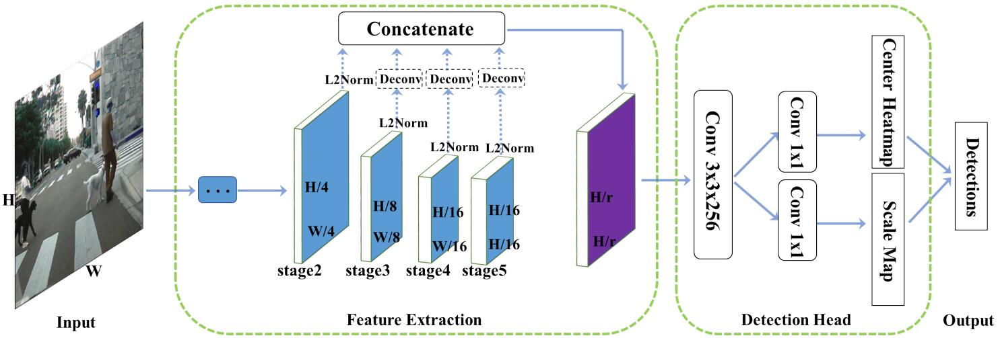

## High-level Semantic Feature Detection: A New Perspective for Pedestrian Detection (CVPR 2019) [\[arxiv\]](https://arxiv.org/abs/1904.02948)

CNN目前在处理特征检测方面比传统方法能取得更好的效果，本文中作者认为目标的**中心点**是一种高度抽象特征，因此可以使用CNN直接进行检测。但本文主要实在行人检测任务上进行验证的。

  

### 论文创新点

1. 本文把行人检测看作是行人中心点和高的预测，而行人的宽可以根据行人的固定比例计算出来；
2. 把行人检测的任务转换成热点图的预测；
3. 是`anchor free`的检测方式，减少了超参数的设置。
