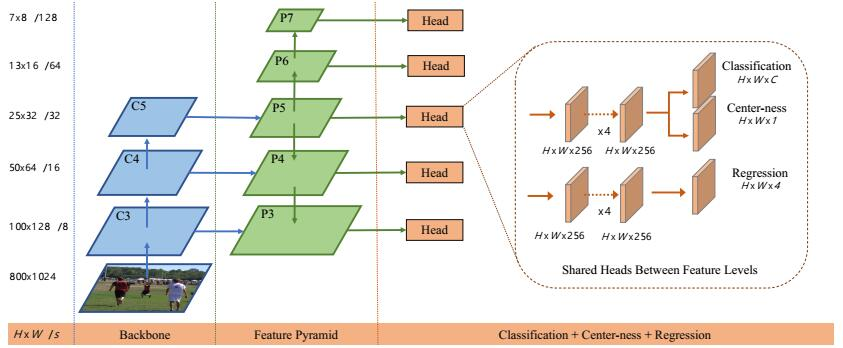
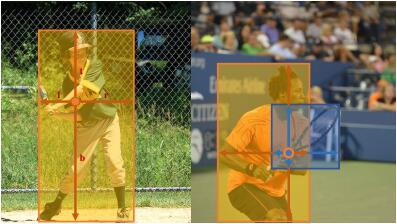

## FCOS: Fully Convolutional One-Stage Object Detection [\[arxiv\]](https://arxiv.org/abs/1904.01355)

论文指出了`anchor-based`方法的多种不足：

1. 超参数多且对结果影响大；
2. 超参数使模型泛化能力差；
3. `anchor`使模型的正负样本不平衡；
4. 大量的`anchor boxes`使模型的计算量和内存使用增加。

同时指出`anchor-free`的优势：

1. 使**目标检测**任务更加接近**实例分割**等密集预测任务，同时可以利用它们现有的技巧；
2. 减少了大量的超参数设计，模型结构更加简单，内存用量更小；
3. `anchor-free`的模型同样可以达到`anchor-based`模型的检测性能；
4. `anchor-free`模型可以拓展到其它密集预测的任务中去。

  
   
  Fig1. FCOS Framework.

  
   
  Fig2. Caculate l, t, r, b of a pixel.

### 论文创新点

1. 提出了一个`label`的分配方法，即`ground truth bounding boxes`内的所有像素都参与预测；
2. 像素点的`label`是它到`ground truth`边界的距离；
3. 提出`Center-ness`分支抑分类制置信度高，但是坐标回归差的结果；
4. 使用多尺度检测(FPN)有效缓解`best possible recall`和`ground truth overlap`问题。

### 论文不足

1. 论文完全没有提及计算复杂度，只是含糊地和`CornerNet`进行了对比；
2. 论文也没有很好地证明它较少超参数的优势，即任务的泛化性能；
3. 论文没有解释使用`Center-ness`和直接计算回归分支的`vector`的模长的区别，只是说实验证明了`Center-ness`分支的必要性。
