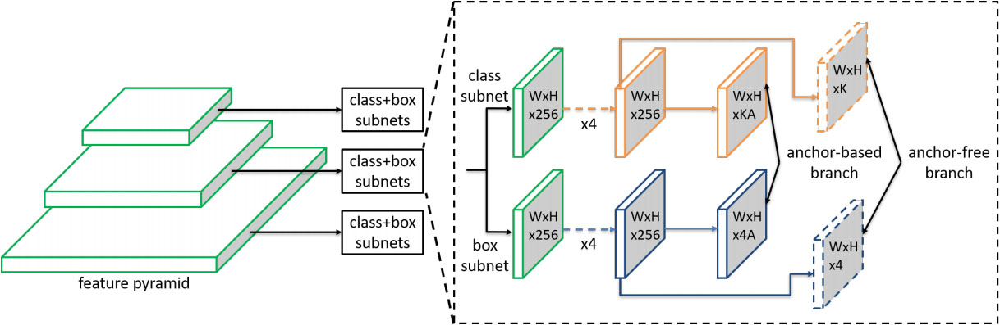
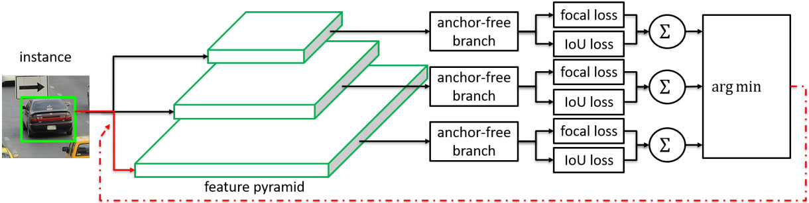

## Feature Selective Anchor-Free Module for Single-Shot Object Detection (CVPR 2019) [\[arxiv\]](https://arxiv.org/abs/1903.00621)

### 论文创新点：

1. 本文认为启发式地把不同尺度的物体硬性地分配到不同特征层上会欠优化，因此提出了一个Feature Selective Anchor Free(FSAF)模块用来选择每一个实例应该从哪个特征图上提取特征；
2. 可以结合`anchor-base`的方法，作为辅助提升检测效果。

  

&nbsp;

  

### 论文不足：

创新点比较少，使用`Retina`作为`Baseline`模型检测速度慢。
