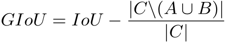

## Generalized Intersection over Union: A Metric and A Loss for Bounding Box Regression (CVPR 2019) [\[arxiv\]](https://arxiv.org/abs/1902.09630)

一般的目标检测数据集都用`IoU`作为`TP`或`FP`的评价指标，但是网络训练过程中却回归坐标值（或是偏移值），`IoU`和`Regression Loss`有时并不一致，因此作者认为应以最大化`IoU`为网络的优化目标，但是当`predicted boxes`和`ground truth`之间没有重叠时，`IoU`不能很好反映两者之间的距离，因为此时`IoU`永远等于`0`。

### 论文创新点

针对`IoU`不能很好表示`predicted boxed`和`ground truth`之间距离的情况，作者提出了一种新的误差计算方式：`GIoU`。

  

`GIoU`的值域范围为`[-1, 1]`，这样各种情况下都能有梯度返回到网络

### 论文不足

1. 论文在训练数据集较小的`YOLOv3`上具有较大的提升，但是对于`COCO`上的`Faster RCNN`和`Mask RCNN`提升效果较小；
2. 实际上以大部分网络的`anchor`密度来算，不可能出现和`ground truth`无重叠的情况；
3. 从demo的图片来看，两者的预测结果几乎无差别。
