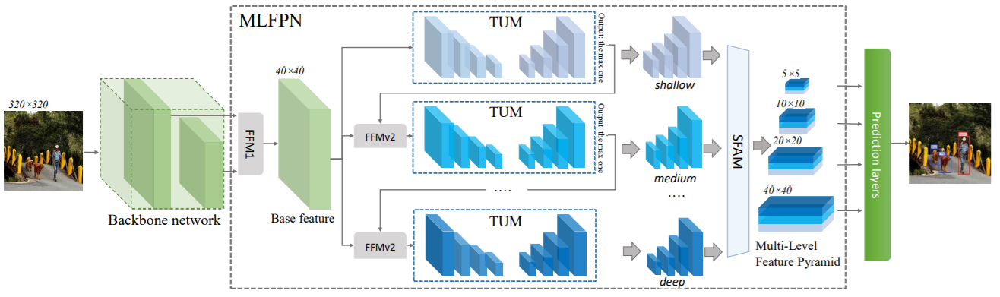
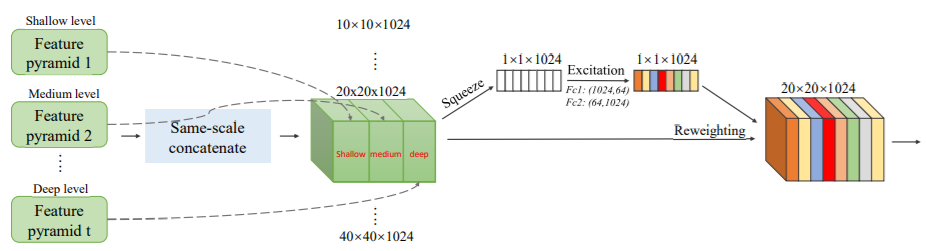
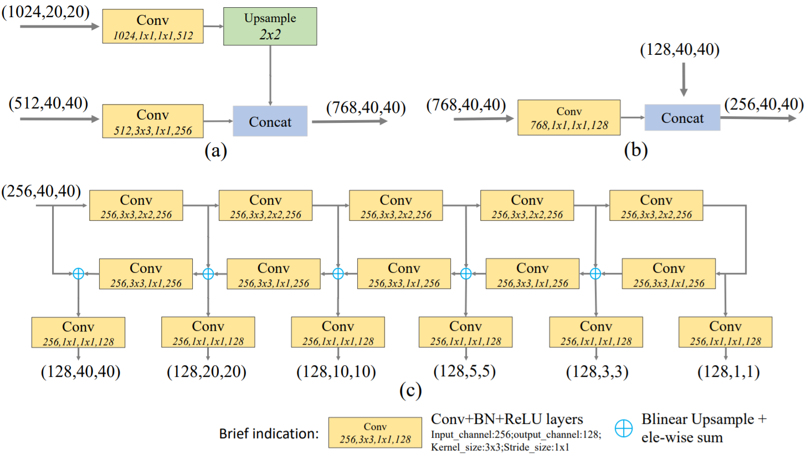

## M2Det: A Single-Shot Object Detector based on Multi-Level Feature Pyramid Network (AAAI 2019) [\[arxiv\]](https://arxiv.org/abs/1811.04533)

论文认为目前处理多尺度目标检测的方法主要有两种，一种是使用图像金字塔，但是这种方法只可以在测试时使用并且计算量巨大；另一种是使用特征金字塔，但是目前的特征金字塔是基于分类模型搭建的，因此不能很好地适应目标检测任务，同时特征金字塔的每一层特征通常只与`backbone`网络的一层或两层特征有关，每层包含的信息不充分；因此本文提出一种**多层级的特征金字塔**模块，在`COCO`上能达到`11.8FPS`和`41.0AP`。

  
   
  Fig 1. Framework.

  
   
  Fig 2. SFAM.

  
   
  Fig 3. TUM

### 论文创新点

1. 提出一个`FFM`结构融合不同的特征；
2. 提出一个`MLFPN`结构生成**多层级的特征金字塔**，`MLFPN`由多个`TUM`结构堆叠而成，而每一个`TUM`由一个`U`型网络组成，并且每一个`TUM`都可以输出一个特征金字塔；
3. 提出一个`SFAM`模块融合不同`level`的特征金字塔，`SFAM`首先把不同`level`的特征金字塔中相同尺度的特征图按照通道维度`concatenate`到一起，然后使用`SE`结构对每个通道进行`reweight`计算，最后在每个尺度的特征图上进行目标检测。

### 论文不足

1. 模型结构过于复杂，核心思想其实是`cascade`的思想，`e.g.` `RefineDet`, `Cascade-RCNN`；
2. 没有提及`soft-NMS`的影响；
