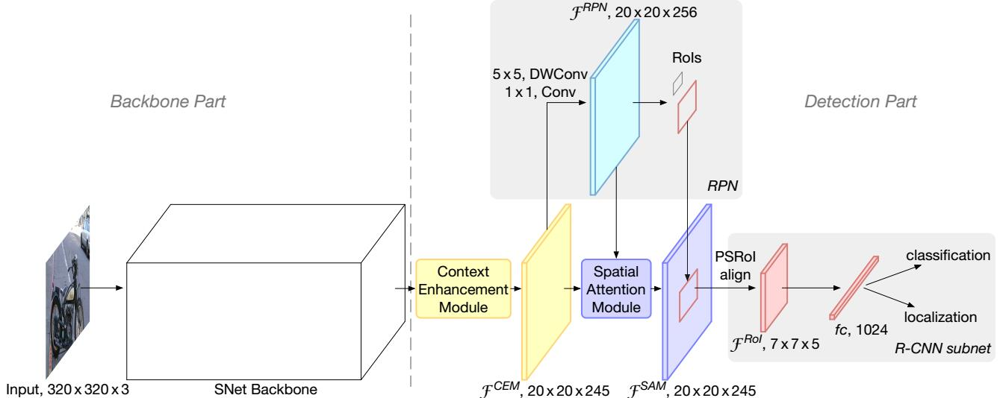
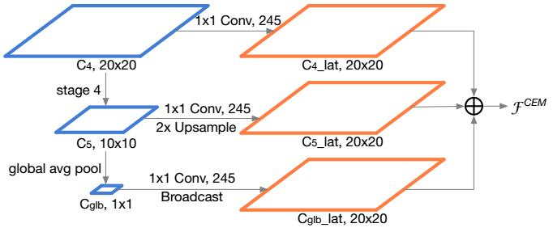
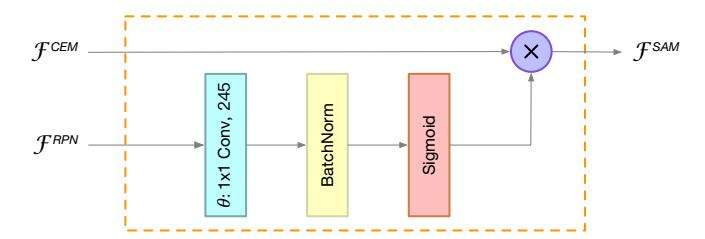
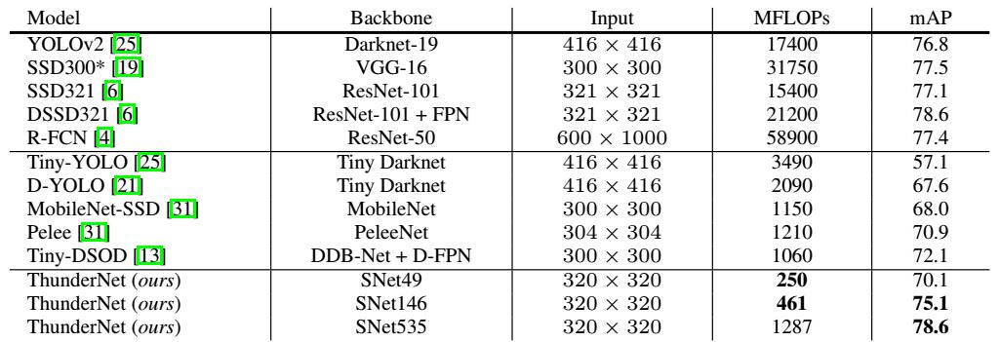

## ThunderNet: Towards Real-time Generic Object Detection [\[arxiv\]](https://arxiv.org/abs/1903.11752)

论文太强大了！论文要论证的就是`two-stage`目标检测模型在速度方面也不会输给`one-stage`模型。论文把目标检测模型分成了`backbone`的特征提取部分和`detection`部分，然后分别就这两部分提出平衡**计算效率**和**效果**的方法。

  
   
  Fig 1. ThunderNet Framework.

对于`backbone`部分，论文指出适合目标检测的`backbone`必须符合三个条件：

1. `backbone`提取到的特征要具有足够的`receptive field`；
2. `backbone`的`early stage`特征要具有足够多的`spatial details`；
3. `backbone`的`late stage`特折要具有足够的`discriminative`。

对于`detection`部分，论文指出：

`detection head`和`backbone`只有匹配效果才是最好的，**头重脚轻**带来冗余的计算量和参数量，**头轻脚重**无法发挥`backbone`带来的特征表达优势；

### 论文创新点

1. 基于`shuffleNet`提出更符合目标检测的特征提取网络`SNet`；
2. 基于`Light-Head R-CNN`提出运算量更小的检测器；
3. 提出`Context Enhancement Module(CEM)`融合不同尺度的特征，同时考虑了计算量；
4. 提出`Spatial Attentinon Module(SAM)`对`CEM`输出的特征进行关注；

  
   
  Fig 2. Context Enhancement Module.
   

  
   
  Fig 3. Spatial Attention Module.
   

  
   
  Fig 4. Detection Results.

