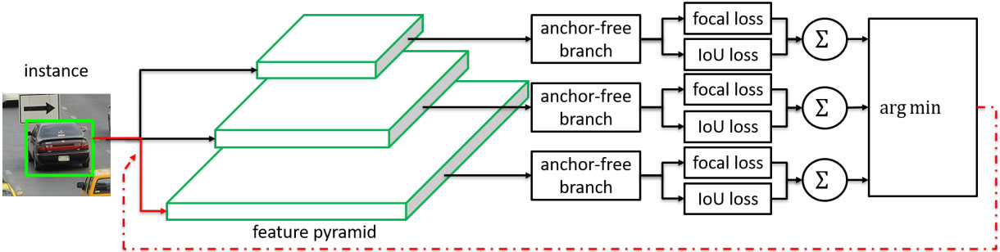
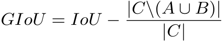

## Feature Selective Anchor-Free Module for Single-Shot Object Detection (CVPR 2019) [\[arxiv\]](https://arxiv.org/abs/1903.00621)

### 论文创新点：

1. 本文认为启发式地把不同尺度的物体硬性地分配到不同特征层上会欠优化，因此提出了一个Feature Selective Anchor Free(FSAF)模块用来选择每一个实例应该从哪个特征图上提取特征。
2. 可以结合Anchor-base的方法，作为辅助提升检测效果

&nbsp;

### 论文不足：

创新点比较少，使用Retina作为Baseline模型检测速度慢。

---

## Generalized Intersection over Union: A Metric and A Loss for Bounding Box Regression (CVPR 2019) [\[arxiv\]](https://arxiv.org/abs/1902.09630)

### 论文动机：

一般的目标检测数据集都用`IoU`作为`TP`或`FP`的评价指标，但是网络训练过程中却回归坐标值（或是偏移值），`IoU`和`Regression Loss`有时并不一致，因此作者认为应以最大化`IoU`为网络的优化目标，但是当`predicted boxes`和`ground truth`之间没有重叠时，`IoU`不能很好反映两者之间的距离，因为此时`IoU`永远等于`0`。

### 论文创新点

针对`IoU`不能很好表示`predicted boxed`和`ground truth`之间距离的情况，作者提出了一种新的误差计算方式：`GIoU`。

  

`GIoU`的值域范围为\[-1, 1\]，这样各种情况下都能有梯度返回到网络

### 论文不足

1. 论文在训练数据集较小的`YOLOv3`上具有较大的提升，但是对于`COCO`上的`Faster RCNN`和`Mask RCNN`提升效果较小。
2. 实际上以大部分网络的`anchor`密度来算，不可能出现和`ground truth`无重叠的情况。
3. 从demo的图片来看，两者的预测结果几乎无差别。

---

## DeRPN: Taking a further step toward more general object detection (AAAI 2019) [\[arxiv\]](https://arxiv.org/abs/1811.06700)

### 论文动机：

目前的二阶段网络大多采用`RPN`作为候选框生成网络，但是`RPN`的召回率很大程度上依靠`anchor boxes`的设定，不同的数据集对`anchor boxes`的要求不一致，这导致不改变超参数的情况下`RPN`缺乏泛化能力，本文提出一种新的`anchor`形式：`anchor string`。通过分别预测边界框的`width`和`height`，DeRPN可以使用更少的参数预测更多`aspect ratio`的框。

### 论文创新点

1. 把`anchor boxes`替换为`anchor string`，使用更少的参数预测更加多样化的框，`DeRPN`的`recall`比`RPN`有了很大的提升
2. 提示了`scale sensitive`的`loss function`，分别计算不同尺度物体的误差，这样有效地缓解了不同尺度物体统一归一化时**占优尺度**对**弱势尺度**的削弱

### what
