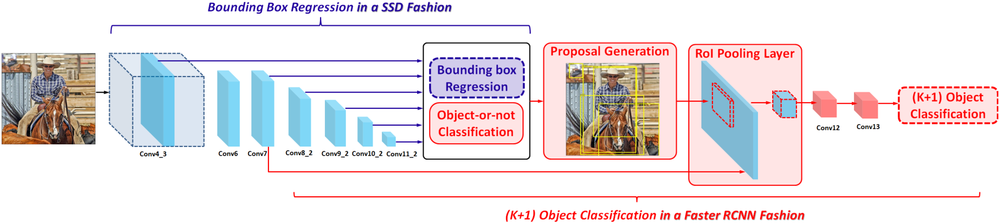
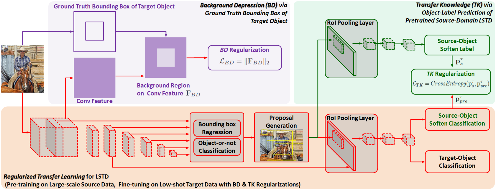
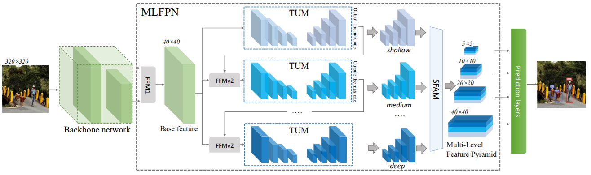
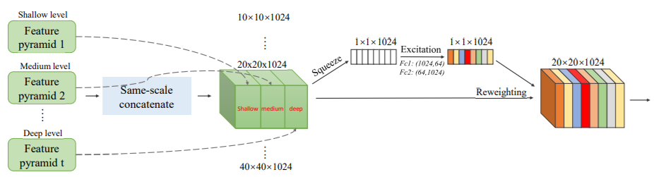
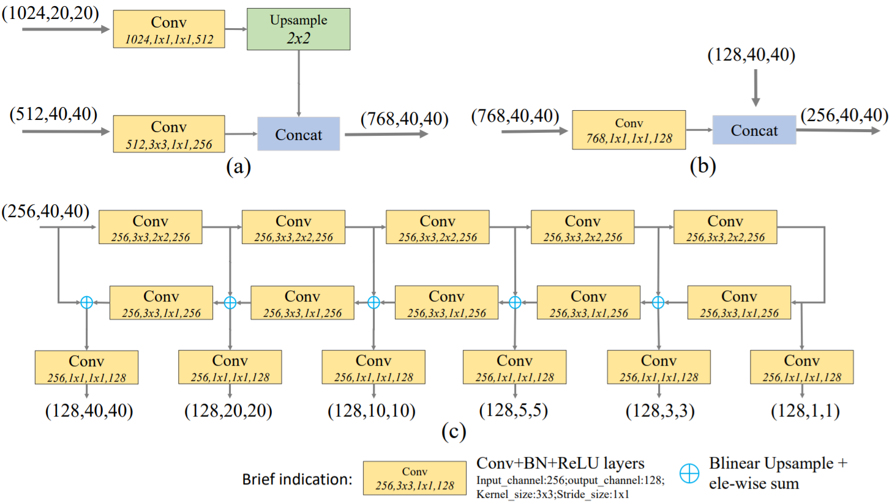
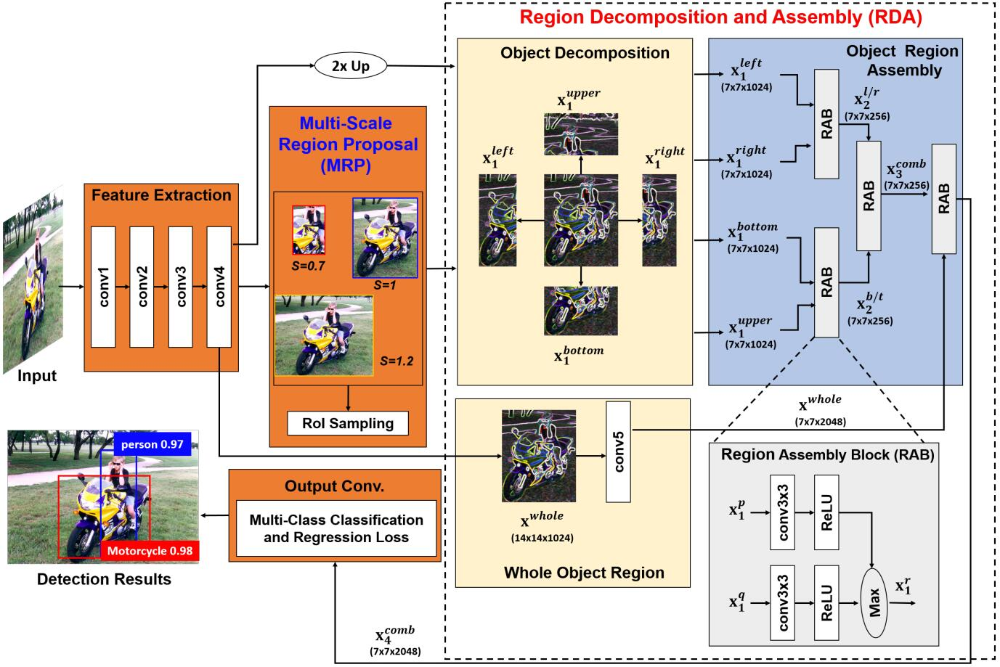
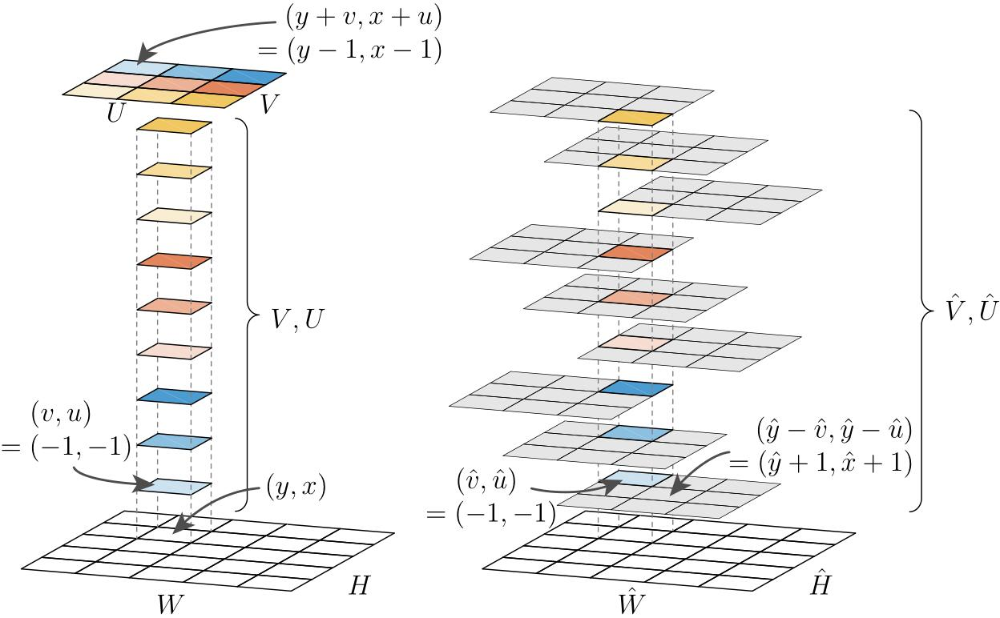

## Feature Selective Anchor-Free Module for Single-Shot Object Detection (CVPR 2019) [\[arxiv\]](https://arxiv.org/abs/1903.00621)

### 论文创新点：

1. 本文认为启发式地把不同尺度的物体硬性地分配到不同特征层上会欠优化，因此提出了一个Feature Selective Anchor Free(FSAF)模块用来选择每一个实例应该从哪个特征图上提取特征；
2. 可以结合`anchor-base`的方法，作为辅助提升检测效果。

  

&nbsp;

  

### 论文不足：

创新点比较少，使用`Retina`作为`Baseline`模型检测速度慢。

---

## Generalized Intersection over Union: A Metric and A Loss for Bounding Box Regression (CVPR 2019) [\[arxiv\]](https://arxiv.org/abs/1902.09630)

一般的目标检测数据集都用`IoU`作为`TP`或`FP`的评价指标，但是网络训练过程中却回归坐标值（或是偏移值），`IoU`和`Regression Loss`有时并不一致，因此作者认为应以最大化`IoU`为网络的优化目标，但是当`predicted boxes`和`ground truth`之间没有重叠时，`IoU`不能很好反映两者之间的距离，因为此时`IoU`永远等于`0`。

### 论文创新点

针对`IoU`不能很好表示`predicted boxed`和`ground truth`之间距离的情况，作者提出了一种新的误差计算方式：`GIoU`。

  

`GIoU`的值域范围为`[-1, 1]`，这样各种情况下都能有梯度返回到网络

### 论文不足

1. 论文在训练数据集较小的`YOLOv3`上具有较大的提升，但是对于`COCO`上的`Faster RCNN`和`Mask RCNN`提升效果较小；
2. 实际上以大部分网络的`anchor`密度来算，不可能出现和`ground truth`无重叠的情况；
3. 从demo的图片来看，两者的预测结果几乎无差别。

---

## DeRPN: Taking a further step toward more general object detection (AAAI 2019) [\[arxiv\]](https://arxiv.org/abs/1811.06700)

目前的二阶段网络大多采用`RPN`作为候选框生成网络，但是`RPN`的召回率很大程度上依靠`anchor boxes`的设定，不同的数据集对`anchor boxes`的要求不一致，这导致不改变超参数的情况下`RPN`缺乏泛化能力，本文提出一种新的`anchor`形式：`anchor string`。通过分别预测边界框的`width`和`height`，DeRPN可以使用更少的参数预测更多`aspect ratio`的框。

### 论文创新点

1. 把`anchor boxes`替换为`anchor string`，使用更少的参数预测更加多样化的框，`DeRPN`的`recall`比`RPN`有了很大的提升；
2. 提示了`scale sensitive`的`loss function`，分别计算不同尺度物体的误差，这样有效地缓解了不同尺度物体统一归一化时**占优尺度**对**弱势尺度**的削弱。

---

## LSTD: A Low-Shot Transfer Detector for Object Detection (AAAI 2019) [\[arxiv\]](https://arxiv.org/abs/1803.01529)

目标检测网络通常需要大量的训练样本，当训练样本严重不足时我们需要使用`weakly-supervised`或者`semi-supervised`的方式进行训练，但是即使使用了前面两种方法，对于`low-shot`的情况，仍然不能达到令人满意的效果。
在本文中，作者通过提出新的**知识迁移**方法，使`target model`能更好地利用`source model`的知识。

  

  

### 论文创新点：

1. 提出`LSTD`模型：`LSTD`模型结合了`SSD`和`Faster RCNN`的特点，即预测没有类别属性的边界框和使用`coarse-to-fine`的分类方方式；
2. 提出了`Background Depression`和`Transfer Knowledge`两种`Regularization`方式，使得`target model`能在`low-shot`情况下有更好的效果。

### 论文不足：

论文中没有提及复杂度的分析，用`LSTD`和`SSD`，`Faster RCNN`比较不太公平。

---

## Gradient Harmonized Single-stage Detector (AAAI 2019) [\[arxiv\]](https://arxiv.org/abs/1811.05181)

`Focal Loss`认为一阶段目标检测模型需要解决的主要难题的正负样本不平衡的问题，本文作者认为正负样本中同时存在着难易样本，因此本质上一阶段目标检测模型面临的问题是难易样本不平衡的问题。而进一步的，难易样本不平衡又反应在了梯度上，因此本文的主要动机是通过均衡化梯度来抑制**易分样本**和**离群子**对梯度的贡献。

### 论文创新点

1. 提出梯度密度的概念，并以梯度密度的倒数为权重因子修正`loss`函数；
2. 提出更平滑的ASL1损失函数。

### 论文不足

没有从理论上探讨什么才是最优的梯度分布，目前的工作都只是基于启发式的思考。

---

## M2Det: A Single-Shot Object Detector based on Multi-Level Feature Pyramid Network (AAAI 2019) [\[arxiv\]](https://arxiv.org/abs/1811.04533)

论文认为目前处理多尺度目标检测的方法主要有两种，一种是使用图像金字塔，但是这种方法只可以在测试时使用并且计算量巨大；另一种是使用特征金字塔，但是目前的特征金字塔是基于分类模型搭建的，因此不能很好地适应目标检测任务，同时特征金字塔的每一层特征通常只与`backbone`网络的一层或两层特征有关，每层包含的信息不充分；因此本文提出一种**多层级的特征金字塔**模块，在`COCO`上能达到`11.8FPS`和`41.0AP`。

  
   
  Fig.1 Framework

  
   
  Fig.2 SFAM

  
   
  Fig.3 TUM

### 论文创新点

1. 提出一个`FFM`结构融合不同的特征；
2. 提出一个`MLFPN`结构生成**多层级的特征金字塔**，`MLFPN`由多个`TUM`结构堆叠而成，而每一个`TUM`由一个`U`型网络组成，并且每一个`TUM`都可以输出一个特征金字塔；
3. 提出一个`SFAM`模块融合不同`level`的特征金字塔，`SFAM`首先把不同`level`的特征金字塔中相同尺度的特征图按照通道维度`concatenate`到一起，然后使用`SE`结构对每个通道进行`reweight`计算，最后在每个尺度的特征图上进行目标检测。

### 论文不足

1. 模型结构过于复杂，核心思想其实是`cascade`的思想，`e.g.` `RefineDet`, `Cascade-RCNN`；
2. 没有提及`soft-NMS`的影响；

## Object Detection based on Region Decomposition and Assembly (AAAI 2019) [\[arxiv\]](https://arxiv.org/abs/1901.08225)

论文认为二阶段网络中存在的受遮挡的`proposal`会影响模型的性能，因此提出`R-DAD`模型，即对`RPN`输出的`proposal`进行区域分解，然后再区域整合。

  

### 论文创新点

1. 提出`multi-scale RPN`，即对`RPN`输出的`proposal`的长和宽乘以一系列系数，得到一系列以原始`proposal`中心进行缩放的`proposal`；
2. 把每个`proposal`按照水平或垂直平分线分成四个区域；
3. 对每个区域使用`region assembly block (RAB)`进行融合。

### 论文不足

1. 论文并没有解析`proposal`如此划分的原因，同时也没有对比其它划分方法；
2. 论文中的`multi-scale region proposal (MRP)`网络并非原创；
3. 网络的复杂度比`baseline`大。

## TensorMask: A Foundation for Dense Object Segmentation [\[arxiv\]](https://arxiv.org/abs/1903.12174)

`sliding-window`的方法在目标检测中使用得很多，并且效果也不错，而在`instance segmentation`中却缺少`sliding-window`这一方法，本文的主要动机就是为了填补这一空缺。

  
   
  Fig. Natural representation vs Aligned representation

### 论文创新点

1. 使用结构化的`4D tensor`来表示`mask`：`(V, U, H, W)`；
2. 定义了`4D tensor mask`的`natural representation`和`aligned representation`，并且给出了两者的变换公式；
3. 定义了在`4D tensor`上运算的`up_align2nat`操作，即对`(V, U)`进行上抽样；
4. 定义了`tensor bipyramid`的特征表示方法，以及定义了`swap_align2nat`操作。

### 论文不足

1. 因为要对每个`sliding-window`输出一个`mask`，因此计算量比`Mask R-CNN`大；
2. 检测效果比`Mask R-CNN`差一点；
